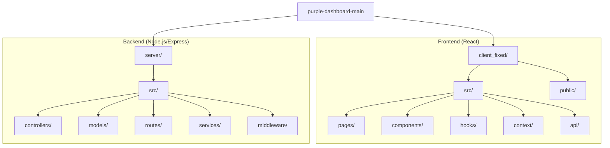

[](https://wazuh.com/)
[](https://www.misp-project.org/)
[](https://ollama.com/)
[](https://github.com/features/actions)
[](https://reactjs.org/)
[](https://www.mongodb.com/)

# Learning Management System (LMS) + Purple Dash Security Dashboard

A comprehensive Learning Management System combined with a Purple Dash SOC (Security Operations Center) dashboard, built with React (Create React App), Node.js/Express, MongoDB, and Wazuh.


## Features

### User Features
- ✅ Course enrollment and progress tracking
- ✅ Material access (PDF, Video, Documents)
- ✅ Quiz attempts with auto-grading
- ✅ Assignment submission and grading
- ✅ Certificate generation and download
- ✅ Real-time notifications
- ✅ Page refresh state persistence
- ✅ Progress analytics per course

### Admin — LMS Features
- ✅ Course management (CRUD)
- ✅ Material upload and organization
- ✅ Quiz and assignment creation
- ✅ User progress monitoring
- ✅ Certificate management and download
- ✅ Notification system
- ✅ Analytics and metrics
- ✅ View and grade assignment submissions

### Admin — Purple Dash (Security Monitoring)

The Admin dashboard includes a full-featured **Purple Dash** SOC panel powered by Wazuh. This is a separate section of the admin view, accessible from the sidebar, and provides real-time security monitoring capabilities:

- ✅ **Dashboard Overview**: Live alert counts (all-time & last 24h), risk distribution pie chart (High/Medium/Low), source activity bar chart, threat classification tag cloud, and trending alert trend-line (filterable by 7d / 15d / 30d / 90d / 180d / 365d)
- ✅ **Incident**: Total alerts, incident queue count, incidents by severity (pie chart), Mean Time to Detect (MTTD), Mean Time to Respond (MTTR), and top alert sources (bar chart)
- ✅ **Threat Intelligence**: Detailed Wazuh threat intelligence data integrated via the Wazuh Indexer API
- ✅ **Networking**: Network traffic monitoring, firewall alerts, malware detections, and active agent counts sourced from Wazuh
- ✅ **User Endpoint**: Per-agent/endpoint monitoring, endpoint health and status view
- ✅ **Compliance**: Audit log volume over time (line chart) and policy violations list sourced from Wazuh
- ✅ **MISP Integration**: Real-time MISP (Malware Information Sharing Platform) alert monitoring, including IOC matches, threat indicators, and MISP-specific statistics sourced from Wazuh
- ✅ **AI Assistant (Security)**: A context-aware AI chat assistant (powered by Qwen 2.5:1.5b via local Ollama) that ingests live Wazuh alert data and answers security questions; falls back to historical dashboard metrics when live API is unreachable; chat history persisted via localStorage
- ✅ **Monitoring Users**: Admin-level view of all registered users and their activity/progress

## Project Structure

```
├── client_fixed/                   # Frontend (React / Create React App)
│   ├── public/                     # Static assets
│   └── src/
│       ├── App.js                  # Root router & protected route logic
│       ├── api/                    # Axios config and API helpers
│       ├── components/
│       │   └── Layouts/            # Shared layout components (AdminLayout, Navbar, Sidebar, Card, etc.)
│       ├── context/                # React contexts (AuthContext, ThemeContext, ThemeBackground)
│       ├── hooks/                  # Custom React hooks (useWazuhSocket, useIncidentsData, useComplianceData, etc.)
│       ├── pages/
│       │   ├── auth/               # Login, Signup, ForgotPassword, ResetPassword
│       │   ├── dashboard/          # User-facing pages (CourseList, OngoingCourses, CompletedCourses,
│       │   │                       #   QuizAttempt, UserQuizzes, UserAssignments, AssignmentSubmit,
│       │   │                       #   Certificates, ProgressAnalytics, DashboardUser, DashboardUserMetrics)
│       │   ├── dashboardAdmin/     # Admin pages (DashboardAdmin, DashboardAdminMetrics,
│       │   │                       #   DashboardAdminIncident, DashboardAdminThreatIntelligence,
│       │   │                       #   DashboardAdminNetworking, DashboardAdminUserEndpoint,
│       │   │                       #   DashboardAdminCompliance, DashboardAdminAI,
│       │   │                       #   DashboardAdminCourses, AddCourseMaterials,
│       │   │                       #   Assignments, Quizzes, MonitoringUsers,
│       │   │                       #   Certificates, AdminSubmissions)
│       │   ├── misc/               # Miscellaneous pages
│       │   ├── CheckEmail.js
│       │   └── Notification.js
│       ├── socket.js               # Socket.io client setup
│       └── utils/                  # Utility functions
│
└── server/                         # Backend (Node.js / Express)
    └── src/
        ├── index.js                # Express server entry point
        ├── config/                 # DB and environment config
        ├── controllers/            # Route controllers
        ├── middleware/             # Auth & role middleware
        ├── models/                 # MongoDB models (User, Course, Material, Enrollment,
        │                           #   Progress, Quiz, QuizSubmission, QuizResult,
        │                           #   Assignment, AssignmentSubmission, Submission,
        │                           #   Certificate, Notification, ActivityLog, CourseMaterial)
        ├── routes/                 # API routes (auth, courses, materials, enrollments,
        │                           #   quizzes, assignments, certificates, notifications,
        │                           #   progress, submissions, users, wazuh, ai)
        ├── services/               # Business logic services
        │   ├── certificateService.js
        │   ├── notificationService.js
        │   ├── wazuhService.js     # Wazuh Indexer API integration (Real-time & Historical)
        │   └── cache.js
        ├── utils/
        ├── wazuhStream.js          # Real-time Wazuh alert streaming via Socket.io
        └── scripts/                # Utility scripts (e.g., publish quizzes, wazuh group tests)
```

### Architecture Diagram



## Installation

### Frontend
```bash
cd client_fixed
npm install
npm start
```

### Backend
```bash
cd server
npm install
npm run dev
```

## Environment Variables

### Frontend (`client_fixed/.env`)
```
REACT_APP_API_URL=http://localhost:5000/api
```

### Backend (`server/.env`)
```
MONGODB_URI=mongodb://localhost:27017/lms
JWT_SECRET=your-secret-key
PORT=5000
NODE_ENV=development
WAZUH_URL=https://your-wazuh-indexer:9200
WAZUH_USER=admin
WAZUH_PASS=your-wazuh-password
OLLAMA_URL=http://localhost:11434
```

## API Endpoints

### Authentication
- `POST /api/auth/login` - User login
- `POST /api/auth/register` - User registration

### Courses
- `GET /api/courses` - Get all courses
- `POST /api/courses` - Create course (admin)
- `PUT /api/courses/:id` - Update course (admin)
- `DELETE /api/courses/:id` - Delete course (admin)

### Materials
- `GET /api/materials/course/:courseId` - Get course materials
- `POST /api/materials` - Upload material (admin)
- `DELETE /api/materials/:id` - Delete material (admin)

### Certificates
- `GET /api/certificates/user` - Get user certificates
- `GET /api/admin/certificates` - Get all certificates (admin)
- `GET /api/certificates/:id/download` - Download certificate
- `DELETE /api/certificates/:id` - Delete certificate (admin)

### Assignments
- `GET /api/assignments/course/:courseId` - Get course assignments
- `POST /api/assignments` - Create assignment (admin)
- `PUT /api/assignments/:id` - Update assignment (admin)
- `DELETE /api/assignments/:id` - Delete assignment (admin)

### Quizzes
- `GET /api/quizzes/course/:courseId` - Get course quizzes
- `POST /api/quizzes` - Create quiz (admin)
- `PUT /api/quizzes/:id` - Update quiz (admin)
- `DELETE /api/quizzes/:id` - Delete quiz (admin)

### Enrollments
- `GET /api/enrollments/user/ongoing` - Get ongoing courses
- `GET /api/enrollments/completed` - Get completed courses
- `POST /api/enrollments/enroll` - Enroll in course

### Notifications
- `GET /api/notifications` - Get user notifications
- `PUT /api/notifications/:id/read` - Mark as read
- `DELETE /api/notifications/:id` - Delete notification

### Wazuh (Security)
- `GET /api/wazuh/metrics` - Get alert counts and recent alerts
- `GET /api/wazuh/logs` - Get raw Wazuh logs
- `GET /api/wazuh/trending` - Alert trends over time (range, interval params)
- `GET /api/wazuh/alerts/count` - Filtered alert count by time range
- `GET /api/wazuh/threat-tags` - Threat classification tag cloud
- `GET /api/wazuh/networking` - Network traffic and firewall data
- `GET /api/wazuh/incident` - Incident-level alert data

### MISP (Malware Information Sharing Platform)
- `GET /api/misp/alerts` - Get MISP alerts with IOC matches and threat indicators
- `GET /api/misp/stats` - Get MISP statistics including alert trends and top source IPs

### AI
- `POST /api/ai/summarize-dashboard` - Send security context + user prompt to the AI assistant (backed by Ollama/Qwen)

## Key Features Implemented

1. **State Persistence**: Uses localStorage and sessionStorage to maintain state across page refreshes
2. **Auto-Certificate Generation**: Certificates are automatically generated when course progress reaches 100%
3. **Real-time Notifications**: Users are notified of new materials, quizzes, assignments, and certificates
4. **Admin Dashboard**: Comprehensive admin panel for managing courses, users, and content
5. **Progress Tracking**: Automatic progress calculation based on materials viewed, quizzes attempted, and assignments submitted
6. **Role-Based Access Control**: Different views and permissions for users and admins
7. **Wazuh Integration**: Real-time security alert streaming over Socket.io using the Wazuh Indexer REST API
8. **MISP Integration**: Real-time monitoring of MISP alerts and threat indicators sourced from Wazuh
9. **AI Security Assistant**: Contextual AI chat that reads live Wazuh alerts and dashboard metrics to answer security-related questions, powered by Qwen 2.5:1.5b via Ollama
10. **Dark / Light Theme**: Fully theme-aware UI across all pages; theme choice persisted via localStorage
11. **Compliance Monitoring**: Audit log volume charting and policy violation tracking sourced from Wazuh

## Testing

### Test Credentials
- **Admin**: admin@example.com / admin123
- **User**: user@example.com / user123

## Output Screenshots:

### AI Assistant:


### MISP Intelligence:


## Deployment

### Frontend (Vercel)
```bash
cd client_fixed
npm run build
vercel deploy
```

### Backend (Heroku/Railway)
```bash
cd server
npm run build
# Deploy to your hosting platform
```

## License

MIT
